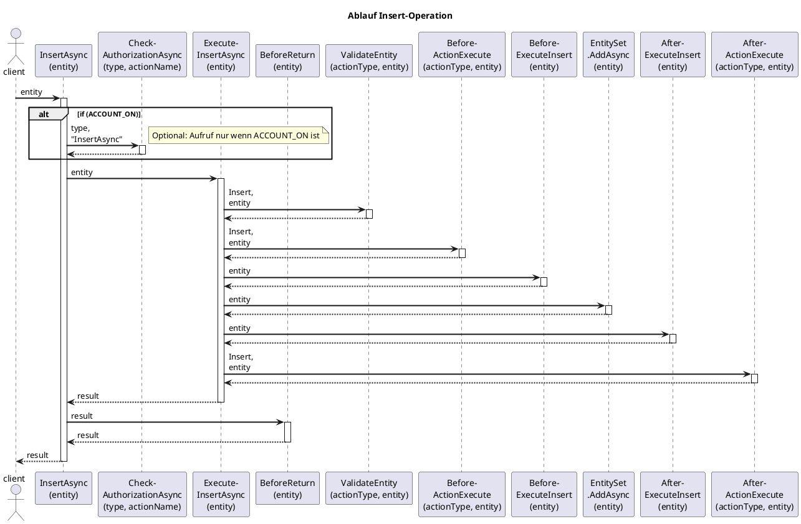
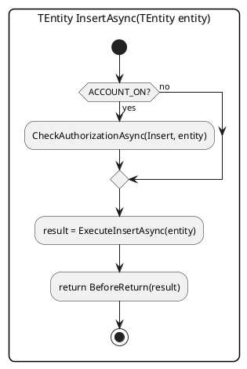
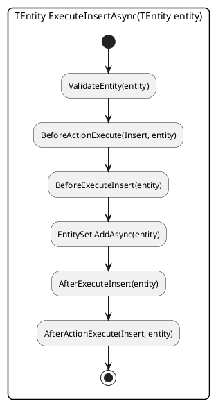

# Logic-Kontroller

Im Projekt ***Logic*** gibt es zu jeder Entitaet einen Kontroller mit der Namenskonvention *Entitaet im plural* und dem Postfix *Controller* und befinden sich im Ordner ***Controllers***. Abgeleitet werden diese Kontroller vom generischen Kontroller **GenericController\<T>**. Mit der Ableitung, vom generischen Kontroller, erben die Kontroller die Standard Operationen (CRUD...Create Read Update and Delete).  

Die Aufgabe eines Kontrollers ist die Kontrolle des Zugriffes und die Pruefung der Dateninhalte der entsprechende Entitaet. Bevor die Entitaet in der Persistierungsschicht (Datenbank) gespeichert wird, werden .
 kontrolliert den Zugriff auf eine Entitaet und uebernimmt die
Ein Kontroller

 (es gibt fuer jede Entitaet einen Kontroller) befindet sich die Geschaeftslogik vom Backend. Zu jeder Entitaet gibt es einen konkreten Kontroller welcher sich vom generischen Kontroller ableitet. Zum Beispiel ist der Kontroller fuer die Entitaet **Customer**  befindet sich die Geschaeftslogik.

## Kontroller

Im Kontroller

## Insert-Opertaion

### Sequence diagram (SD) "TEntity InsertAsync(TEntity entity)"

### Activity diagram (AD) "TEntity InsertAsync(TEntity entity)"

> HINWEIS:
> Ist die Direktive ***ACCOUNT_ON*** definiert, dann wird die Benutzerberechtigung geprueft.

#### Activity diagram (AD) "TEntity ExecuteInsertAsync(TEntity entity)"

> Hinweis:  
> Alle angefuerten Methoden sind mit ***virtual*** spezifiziert und koennen in der Unterklasse angepasst (ueberschrieben ***override***) werden.

